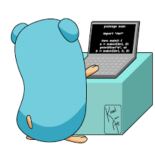

# hello-go

## references
   * [Shichao's Notes on Go](https://notes.shichao.io/gopl/): an in-depth coverage of the topics with lots of practical insights
   * [Learn Go with Tests](https://quii.gitbook.io/learn-go-with-tests)
   * [Go by example](https://gobyexample.com/)
   * [Go 1.11 Rocket Tutorial](https://getstream.io/blog/go-1-11-rocket-tutorial/)
